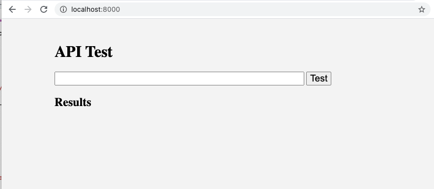
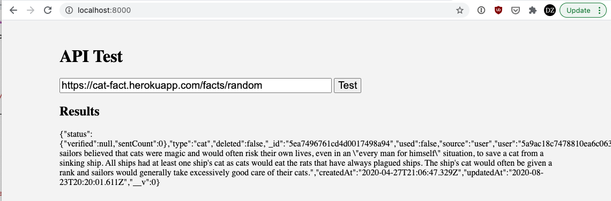
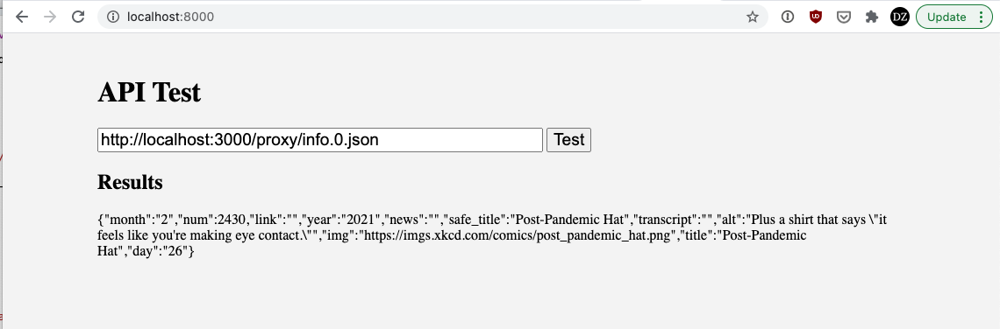

# CORS Proxy Tutorial

Imagine you are developing a web application that uses a [public API](https://github.com/public-apis/public-apis).
When you try to make a request to this API from your front end, you may encounter an error like this:

```
Access to fetch at 'https://trefle.io/api/v1/plants/search?token=XXXXX&q=fern' from origin 'http://localhost:8000' has been blocked by CORS policy: No 'Access-Control-Allow-Origin' header is present on the requested resource. If an opaque response serves your needs, set the request's mode to 'no-cors' to fetch the resource with CORS disabled.
```

This means the request your browser sent to the server has violated the the server's [Cross-Origin Resource Sharing (CORS)](https://developer.mozilla.org/en-US/docs/Web/HTTP/CORS) policy.

## What is CORS?

Cross-Origin Resource Sharing is a security policy a web browser follows when it fetches a resource (such as a list of plants from a plants database) from a *different* web site. In this case, you were developing code on your local machine, so the origin is `http://localhost:8000` and this does not match the server you are requesting resources from `https://trefle.io`. Browsers consider this kind of cross-origin request to be insecure by default. For example, if you visited a website called `attacker.com` and that website made a request to `gmail.com` to read your email, this policy would block the request.

For the origin to match, all three parts of a URL are considred -- the protocol (HTTP, HTTPS), the domain (localhost, trefle.io), and the port (8000, 443). The following do *not* match: `https://domain.com` and `https://api.domain.com`. Likewise, `http://localhost:8000` and `http://localhost:3000` do not match.

## Access control policies

When someone sets up a server with a public API, then can control how their server is used through access control policies. These policies are set using HTTP headers that the server returns in its responses. For example, if a server returns the following header:

```
Access-Control-Allow-Origin: *`
```

then this tells the browser that it can use this resource from any origin. If a server returns the following header:

```
Access-Control-Allow-origin: https://amazon.com
```

then this tells the browser that it can only request this resource from a page on `https://amazon.com`. 

In the case of the error above with `trefle.io`, the server did not have any `Access-Control-Allow-Origin` header present. This means that by default your browser will block the request for any other origin.

## Test for CORS errors

How do you know if an API is truly open for public consumption or whether CORS errors will block you?
This repository contains a test to see if an API is blocked by CORS. Clone this repository:

```bash
git clone git@github.com:BYU-CS-260/cors-proxy-tutorial.git
```

Then, in the `cors-proxy-tutorial` direcotyr, run a local web server using:

```bash
python3 -m http.server
```
or
```
npm install --global http-server
http-server -p 8000
```

Now if you navigate to `localhost:8000` in your browser, you should see:



Let's test the [Cat Facts](https://alexwohlbruck.github.io/cat-facts/) API by entering the following into the text box:

```
https://cat-fact.herokuapp.com/facts/random
```

This should display:



You can see that we got a good response from the server.

However, if you test the [xkcd API](https://xkcd.com/json.html):

```
http://xkcd.com/info.0.json 
```

You will get the error message `Failed to fetch`, and if you open the browser's JavaScript console, you will see the CORS error that stopped the fetch.

## Browser extensions not recommended

You may find some sites telling you that you can use a browser extenson to override the CORS policy in your browser. This does work! But it will only work for you when you have the browser extension installed -- every other visitor to your site will still get CORS errors. This is probably not what you want. In addition, these extensions are disabiling a security policy in your browser, and if you leave this extension enabled it may expose you to nefarious sites that take advantage of the security policy being disabled.

## Run a CORS proxy

The CORS policy only applies to browsers. Servers can request any resource they want from another server. If you are developing a web application that needs to access a public API, you probably will eventually have a back end for your web application. In that case, you can simply send the API requests from your back end and relay the results to your front end, and your site will have no issues with CORS.

What if you only have front end code? You can easily set up a back end to act as a CORS proxy. You will setup a back end that just takes incoming requests from your front end, sends them to the public API server, gets the response, and then returns the response to your front end.

```
front end <--> back end <--> public API
```

## Running a CORS proxy locally

This repository contains a very simple CORS proxy. Clone this repository:

```bash
git clone git@github.com:BYU-CS-260/cors-proxy-tutorial.git
```

Next, go to that directory and edit `cors-proxy.js`, changing the `PUBLIC` variable so that it has the URL of the server with the public API.

Then, in the `cors-proxy-tutorial` direcotry run the following command to install node libraries that this code needs:

```
npm install
```

Finally, you can run the proxy with:

```
node cors-proxy.js
```

This will run on port 3000. 

## Testing the proxy

Edit the `PUBLIC` variable so it contains:

```
https://xkcd.com/
```

Kill and restart the proxy, and then use the API test and try the xkcd API again:

```
http://localhost:3000/proxy/info.0.json
```

You should now see the result being returned:



## Running a proxy on Digital Ocean

To run the proxy on Digital Ocean, follow the same steps as for running it locally. You will then need to allow that port to get through the firewall with:

```
sudo ufw allow 3000
```

## What about a universal proxy?

It would be fairly simple to create a universal proxy by having the front end include the server URL, rather than hard-coding it in the PUBLIC variable. For examlpe, the [CORS Anywhere](https://github.com/Rob--W/cors-anywhere) proxy has been setup to be hosted on Heroku, a cloud application platform. However, (1) this is often against the policy of hosting providers, and (2) various proxies setup like this have had to shutdown over time due to heavy traffic and/or abuse. It is a good idea to limit your proxy so that it only serves traffic for your site and for the public API you need.
